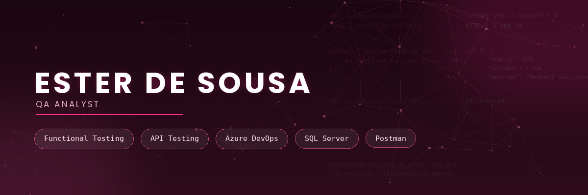

  

<strong>QA Analyst</strong> • Testes Funcionais • Testes Exploratórios • APIs REST

---

# 🛠 Tecnologias

 

---

# 🚀 Projetos em destaque

### 🌐 Portfolio
Meu portfólio profissional desenvolvido em HTML, CSS e JavaScript.

🔗 https://estersousa12.github.io/portfolio/

📁 https://github.com/estersousa12/portfolio

---

### 🧪 Postman for QA
Projeto com coleções, documentação e validações de APIs REST utilizando Postman.

📁 https://github.com/estersousa12/postman-for-qa

---

### 🗄 SQL for QA
Consultas SQL aplicadas à validação de dados em cenários de testes.

📁 https://github.com/estersousa12/sql-for-qa

---

# 👋 Sobre mim

Sou QA Analyst com experiência em testes funcionais, exploratórios e APIs REST.

Atuo desde a análise de requisitos até a validação em produção, criando cenários de testes, documentando evidências, validando regras de negócio e realizando consultas SQL Server para conferência de dados.

Também utilizo Inteligência Artificial como apoio na documentação técnica, análise de requisitos e produtividade, sempre validando os resultados antes da utilização.

---

# 💡 Competências

### ✅ Testes

`Funcionais`
`Exploratórios`
`Regressivos`
`Não Funcionais`
`Validação com Usuários`
`Homologação`

### 🌐 APIs

`REST`
`Postman`
`Status Code`
`Headers`
`Request Body`
`Response Body`
`Schema Validation`

### 🗄 Banco de Dados

`SQL Server`
`Consultas SQL`
`Validação de Dados`
`Massas de Teste`

### 🛠 Ferramentas

`Azure DevOps`
`Git`
`GitHub`
`VS Code`

### 🤖 IA aplicada ao QA

- Documentação Técnica
- Elaboração de Cenários de Teste
- Análise de Requisitos
- Organização de Evidências
- Produtividade

---

# 🎓 Formação e Certificações

- Tecnólogo em Análise e Desenvolvimento de Sistemas
- PTQS — Júlio de Lima
- QA Turbo — Qazando
- Introdução a SQL
- Testes Automatizados

---

# 📬 Contato

📧 **E-mail**

estersousa_ata@outlook.com

💼 **LinkedIn**

https://www.linkedin.com/in/ester-de-sousa-666265248/

🌐 **Portfólio**

https://estersousa12.github.io/portfolio/

---

<b>Obrigada pela visita! 😊</b>

Sempre aberta a novos desafios e oportunidades na área de Qualidade de Software.

  

<i>"Qualidade não é apenas encontrar defeitos. É construir confiança em cada entrega."</i>

